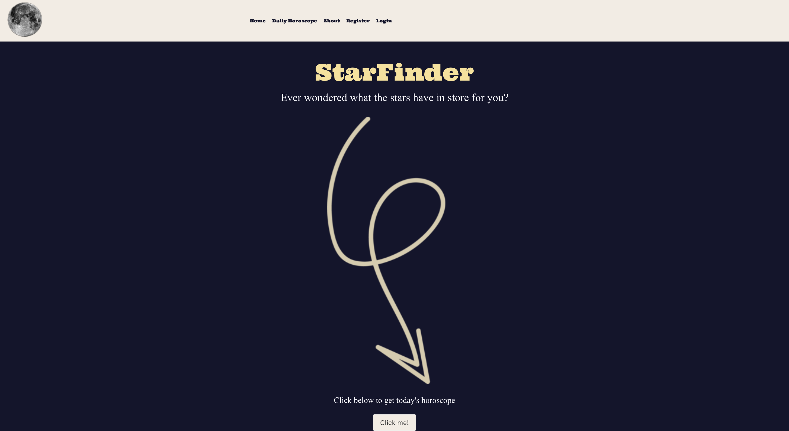
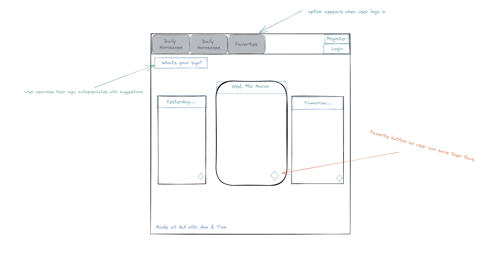
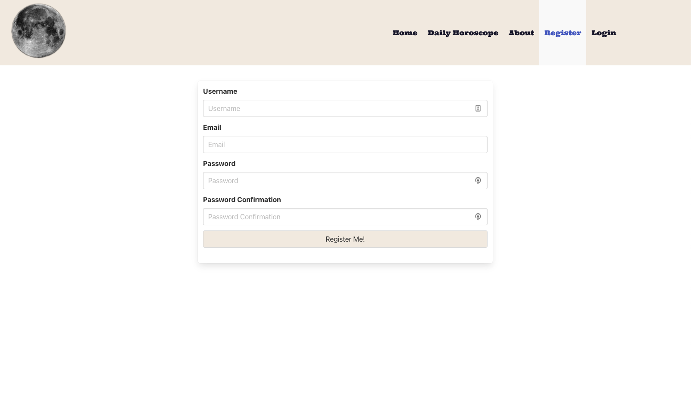
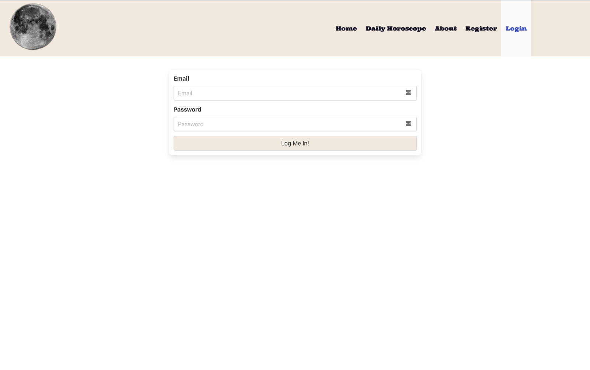
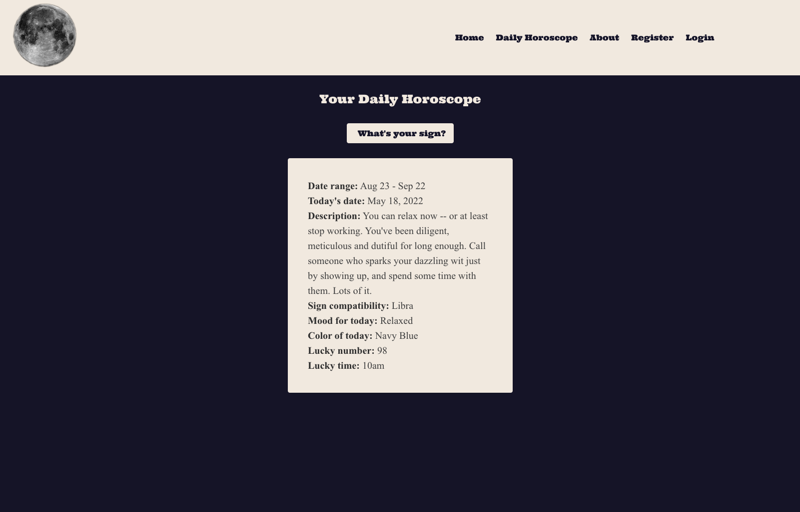

# GA Project Two - Horoscope App

<div align="center">

</div >

## Technologies Used

- [Horoscope API](https://github.com/sameerkumar18/aztro)
- JavaScript
- React.js
- Git
- Css
- Axios / Ajax
- Postman

## To Contribute

To contribute to this project, [fork the repo](https://github.com/Mafalda-hub/Horoscope) and create a pull request with your changes.

## The Brief

For project 2, we were given the challenge of building a React application consuming a 3rd party public API of our choice. We had to create several components and a router. The project was to be completed in pairs to gain experience in pair programming, collaborating with other developers using tools such as `git` and best practices such as `branching, pull requests and code reviews`.

## The Approach Taken

- Day 1 - Planning

  - Before we could start creating the application, we first needed to do some research into a suitable 3rd party open API that we could consume to provide data for our app. We started out by searching for open APIs that could be used without having to use a proxy to get around any `CORS` issues.
  - We used `Postman` to test out different APIs to see if we could get responses with suitable data to create features for our app and to also test the responses and ensure that we would not be limited by request limits or CORS.
  - Once we had found the [Horoscope API](https://github.com/sameerkumar18/aztro) we then started to plan out what features would need to be built to achieve our MVP. To do this, we created a simple wireframe.

<div align="center">

</div >

- Day 2 - Building the UI

  - On the second day of the project, we started to build the components that would make up the UI using `React.js`. We decided to split the list of components that we needed to build so that we would not be working on the same files and avoid duplicating work or encountering merge conflicts in our git workflow.

  - We first created some components that would render some basic UI and then worked on creating functions to interact with the API so that we could build the rest of the UI using the data that was returned from our AJAX calls.

```js
import axios from 'axios';

const baseUrl = 'https://aztro.sameerkumar.website';

export const todaysHoroscope = () => {
  return axios.get(`${baseUrl}/sign`);
};

export const getSingleSign = (sign) => {
  return axios.post(`${baseUrl}?sign=${sign}`);
};

export const registerUser = (user) => {
  return axios.post(`${baseUrl}/register`, user);
};

export const loginUser = (user) => {
  return axios.post(`${baseUrl}/login`, user);
};
```

- Now that we had the functions created to be able to register and login a user, we created the UI to allow end users to fill out forms enabling them to register and ultimately, login to their account.

<div align="center" margin-bottom="30px">

</div >

<div align="center">

</div >

- With users now able to create accounts and login to the app, we were able to build the UI to display horroscopes, based on the response from the API. Below is an example of the response data that would be returned from a request for a specific star sign:

```json
{
  "date_range": "Mar 21 - Apr 20",
  "current_date": "May 18, 2022",
  "description": "A certain someone you're just fascinated with is acting a little too detached for your tastes. It might be tempting to throw a tantrum to get a reaction, but aren't you above all that? You're the lion. Stalk off proudly.",
  "compatibility": "Pisces",
  "mood": "Accomplished",
  "color": "Purple",
  "lucky_number": "8",
  "lucky_time": "10pm"
}
```

- Based on this data, we were able to create a React component that would render any star sign:

<div align="center">

</div >

```js
import React from 'react';
import Dropdown from './Dropdown';
import { getSingleSign } from '../lib/api';
import Footer from './Footer';

const signs = [
  'Aries',
  'Taurus',
  'Gemini',
  'Cancer',
  'Leo',
  'Virgo',
  'Libra',
  'Scorpio',
  'Sagittarius',
  'Capricorn',
  'Aquarius',
  'Pisces',
];

const DailyHoroscope = () => {
  const [sign, setSign] = React.useState('');
  const [horoscope, setHoroscope] = React.useState(null);

  React.useEffect(() => {
    if (sign) {
      async function getData(params) {
        const { data } = await getSingleSign(sign);
        setHoroscope(data);
      }

      getData();
    }
  }, [sign]);

  return (
    <section className="hero is-fullheight-with-navbar hero-background">
      <div>
        <Dropdown
          handleClick={setSign}
          formLabel="Choose a sign"
          buttonText="Send sign"
          action="/"
          signs={signs}
        ></Dropdown>
        <div className="card">
          <div>
            {!!horoscope && (
              <p>
                {' '}
                <strong>Date range:</strong> {horoscope.date_range}
              </p>
            )}
            {!!horoscope && (
              <p>
                {' '}
                <strong>Today's date:</strong> {horoscope.current_date}
              </p>
            )}
            {!!horoscope && (
              <p>
                {' '}
                <strong>Description:</strong> {horoscope.description}
              </p>
            )}
            {!!horoscope && (
              <p>
                <strong>Sign compatibility:</strong> {horoscope.compatibility}
              </p>
            )}
            {!!horoscope && (
              <p>
                <strong>Mood for today:</strong> {horoscope.mood}
              </p>
            )}
            {!!horoscope && (
              <p>
                <strong>Color of today:</strong> {horoscope.color}
              </p>
            )}
            {!!horoscope && (
              <p>
                <strong>Lucky number:</strong> {horoscope.lucky_number}
              </p>
            )}
            {!!horoscope && (
              <p>
                <strong>Lucky time:</strong> {horoscope.lucky_time}
              </p>
            )}
          </div>
        </div>
      </div>
      <Footer />
    </section>
  );
};

export default DailyHoroscope;
```

- Day 3 - Static Pages and Styling

  - The third and final day of the build was spent putting together the static <em>Home</em> and <em>About</em> pages.
  - We also used this time to create the logo for the application and style the pages using custom CSS. We had an option to use a CSS framework such as Bulma, but we made the decision to write the CSS ourselves and take the opportunity to practise styling.

## BUGS, BLOCKERS & WINS

- At this point, the register and login pages aren't quite working, but after a little investigation this is simply due to not handling the token that is returned from the login. This is something that we will address in an update at a later stage, as it is not a critical bug for the performance or functionality of the application.
- The design was mostly done by Tom whereas I did most of the backend. We then figured that this wasn't a smart choice and should’ve organised ourselves better by using a Trello board instead of communicating only through Zoom calls and Slack.

## FUTURE FEATURES + KEY LEARNINGS

- The idea is to keep working on this project and let the user register and login so that they’ll be able to add their sign to their “favourites page”, allowing them to access it much faster and create better UX.
- At this stage, we didn't have enough time or knowledge to allow us do exactly what we’d imagined previously and wireframed in excalidraw. It was our first collaborative project so we spent a lot of time trying to figure out branching, pulling, pushing and merging different branches to create a colaborative git workflow.
